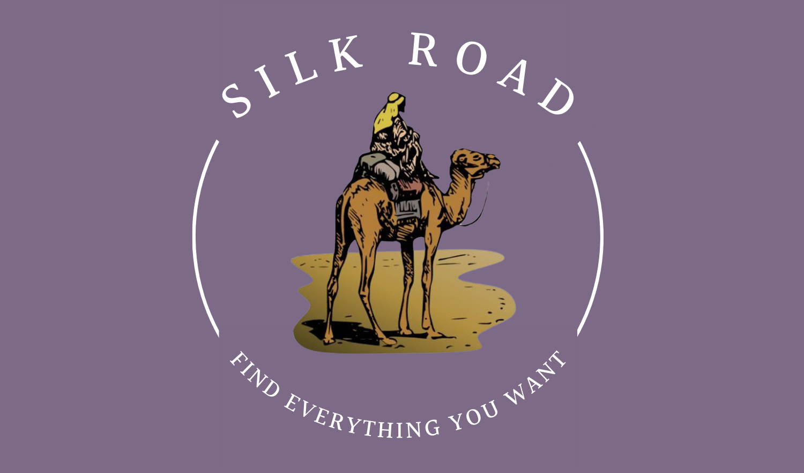

# SilkRoad

<p align="center">
  
</p>

**_<h4 align="center"> A place where you can sell/buy anything you want! </h4>_**

<p align="center">
  <a href="#contributors">Contributors</a> •
  <a href="#introduction">Introduction</a> •
  <a href="#how-to-use">How to Use</a> •
  <a href="#key-features">Key Features</a>
</p>


:star: Star us on GitHub — it motivates us a lot!

## Contributors

* [**Farbod Khorramvatan**](https://github.com/Farbodkhm)
* [**Pooyan Oskouhi**](https://github.com/pooyanosk1382)
* [**Ali Bakhshesh**](https://github.com/alib2014)


## Introduction

`Silk Road` is a digital market place on windows desktop where usres can post their advertisements, see other's advertisements, communicate/negotiate with them through chat option, save their favorites, search among all items and so on.


## How to Use
First you need to clone the project
````
git clone https://github.com/Farbodkhm/SilkRoad.git
````
Then you need to run the Server.java in a specific port

> **Note**
> Clients & server must be in the same local network

After the server is up, put the IP & Port of the sever in CreateSocket.java and then, run Main.java!


## Key Features

<details>
<summary>Accounts</summary>
  
  >You can either enter with your personal account or enter as a guest to view the ads

<p align="center">
  
</p>


The city name you enter must be valid(One of cities of Iran)

Also, the strength of your password will be checked simultaneously as you enter it.
</details>

<details>
<summary>Captcha System</summary>
  
A simple captcha is required for entering the app

<p align="center">
  
</p>
</details>

<details>
<summary>Email Verification</summary>
  
Your email will be validated with an OTP

<p align="center">
    
&nbsp;
    
</p>
</details>

<details>
<summary>Password Recovery</summary>
  
In case of forgetting your password, you can recover it easily!

<p align="center">
  
</p>
</details>

<details>
<summary>Chat & Notification System</summary>
  
You can send direct messages to the owners of the advertisements and communitace with them. Also, notification of your unread messages will pop up as soon as you login to your account
</details>

<details>
<summary>Switch between themes(Dark & Light)</summary>
  
In any page you are, you can switch to the another theme
</details>

<details>
<summary>Security</summary>
  
All communications between client & server will be ecrypted using AED encryption. Also, all passwords will be hashed and then will be stored in database
</details>

<details>
<summary>Multi-thread Programming</summary>
  
In order to handle all users cuncurrently, multi-thread concepts are used and they are syncronized appropriately to avoid any multi-threading problems
</details>


